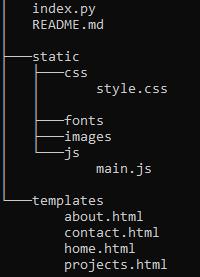

# Website Project Hadsonpar 2024
Hadsonpar website project, developed in Python and Flask
## Creating files and directories the project from git bash
- **[git bash]** touch index.py    
- **[git bash]** mkdir templates
    - Now, creating html file
        - **[git bash]** touch home.html
        - **[git bash]** touch about.html
        - **[git bash]** touch projects.html
        - **[git bash]** touch contact.html
- **[git bash]** mkdir static
    - Now, creating directories to files the project
        - **[git bash]** mkdir images
        - **[git bash]** mkdir css
            - **[git bash]** touch style.css
        - **[git bash]** mkdir js
            - **[git bash]** touch main.js
        - **[git bash]** mkdir fonts
## Validating and installing Framework
### Python version validation - Command
- **[cmd]** python --version
### Pip version validation - Command
- **[cmd]** pip --version
### Flask Install
- **[cmd]** pip install flask
## Load the project from Python terminal
- **[python]** python index.py
## Base structure of the project - v1.0.1
